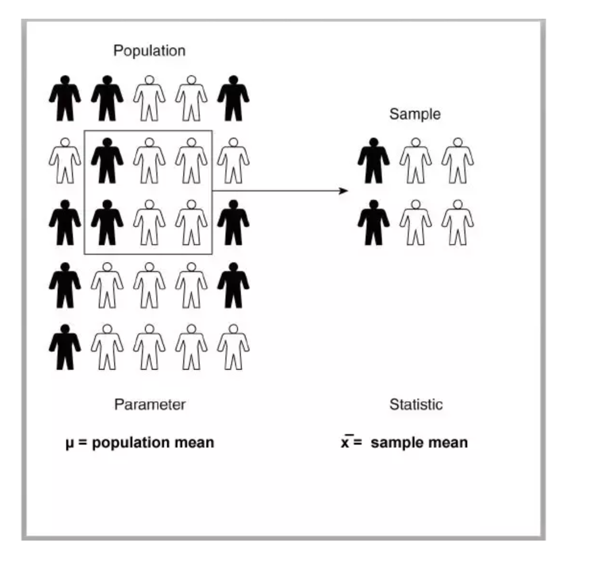

1. What is the difference between the population and the sample? What is the difference between parameter and statistic? 
Tags: #population #sample #parameter #statistic

Population and parameter are the universal set.

In statistics, a population is an entire pool from which a statistical sample is drawn. Examples of populations can be the number of newborn babies in North America, the total number of tech startups in Asia.

A parameter is any summary number, like an average or percentage, that describes the entire population. Since we can't measure the entire population, therefore, measuring its parameter is also difficult.

For example, the average height of adult women in the United States is a parameter that has an exact value — we just don’t know what it is! or the average height of all CFA exam candidates in the world, the mean weight of U.S. taxpayers, and so on.

We know what we have to collect and that collection is termed sample (a specific set from the population). Parameters associated with it would be sample parameters like sample mean or sample standard deviation and are referred to as statistic.

 

 

2. When should I use pmf, pdf, cdf, and ppf functions while calculating probabilities?
Tags: #pmf #cdf #ppf #probabilities

Let's understand the functions with probability notations.

Suppose that X is a discrete random variable. Now, when we want to calculate mass probabilities, like P(X=x), we use the pmf function. This is the probability that X takes the value x. An example of discrete distribution is Binomial Distribution.

The pdf function is similar to the pmf function except for the fact that it is used for continuous distributions. An example of continuous distributions is Normal Distribution. If X is a continuous random variable, we calculate the probability that X takes the value x, P(X=x) using the pdf function.

The cdf function helps us calculate the cumulative probability P(X<=x), which is the probability that X takes the value less than or equal to x. This is the cumulative distribution function and is applicable in both discrete and continuous cases.

The ppf function is an inverse form of the cdf function. Suppose P(X<=x) = alpha, where we are provided the alpha (probability) value, then we can calculate the value of x using the ppf function. This is the Percent Point Function and is applicable in both discrete and continuous cases.

 

3. How to set the value of k for binom.pmf() and binom.cdf() functions?
Tags: #pmf #cdf #probability

If we want to calculate the probability that the random variable X is exactly equal to x, that is P(X=x), then binom.pmf(k=x,...) will be used.
If we want to calculate the probability that the random variable X is less than or equal to x, that is P(X<=x), then binom.cdf(k=x,...) will be used.
If we want to calculate the probability that the random variable X is greater than or equal to x, that is P(X>=x) = 1-P(X<x) = 1-P(X<=x-1), then 1-binom.cdf(k=x-1,...) will be used.
 

4. How to choose loc and scale for a continuous random variable following uniform distribution?
Tags: #uniform distribution #loc #scale

In scipy.stats.uniform(), the parameters loc and scale refer to the starting point and range of the uniform distribution.  Using the parameters loc and scale, one obtains the uniform distribution on [loc, loc + scale]. For a continuous random variable following uniform distribution on [1, 4], loc and scale will be 1 and 3 respectively.

In general, if X~U(a,b), the loc and scale are a and (b-a) respectively.

 

5. What is z-score and how is it used in real-life scenarios?
Tags: #z-score #standard deviations

A z-score (also called the standard score) measures how many standard deviations below or above the mean a data point lies. The z-score is very useful as it enables us to compare two scores coming from two different normal populations. The two scores might be on two different scales however we can compare them using the z-score.

Real-life application – Suppose you have appeared for two different competitive exams having different scoring systems. How will you compare your scores’ in two exams? Let’s assume that the competitive exams are popular and the distributions of their scores follow two different normal distributions. To compare your scores (coming from two different normal populations), you need to standardize each of your scores. Then, you can easily compare them.

 

6. What does norm.ppf() do?
Tags: #ppf #cdf #probability

The norm.ppf() function is the inverse of the norm.cdf() function. It takes a percentage p and returns a point such that the probability of the normal random variable being less than or equal to that number is p%. Thus, it just does the opposite work of norm.cdf().

For example, if the percentage p is equal to 0.92, you will get the point below which 92% of data falls. This also means that 8% of data falls above that point. 

 

7. When we evaluate the probability to the right of a binomial distribution using 1-binom.cdf(), we subtract 1 from the k. But, in a normal distribution, we do not subtract 1 from x while we calculate the probability to the right of the distribution using 1-norm.cdf(). Why there is such a difference?
Tags: #cdf #distribution #continuous

This is due to the fact that binomial distribution is a discrete distribution; whereas normal distribution is a continuous one. The cdf() function behaves differently for a continuous distribution and a discrete distribution. In the case of a continuous distribution, the cdf is a strictly monotonic increasing continuous function; whereas the cdf of a discrete distribution is a step function.

Thus, according to the definition of cdf(), 1-binom.cdf() will calculate the probability that X is greater than a certain value. 1-norm.cdf() will also do the same thing. But for continuous function, we do not have to subtract any value as the probability at a single point is always zero.

 

Happy Learning!